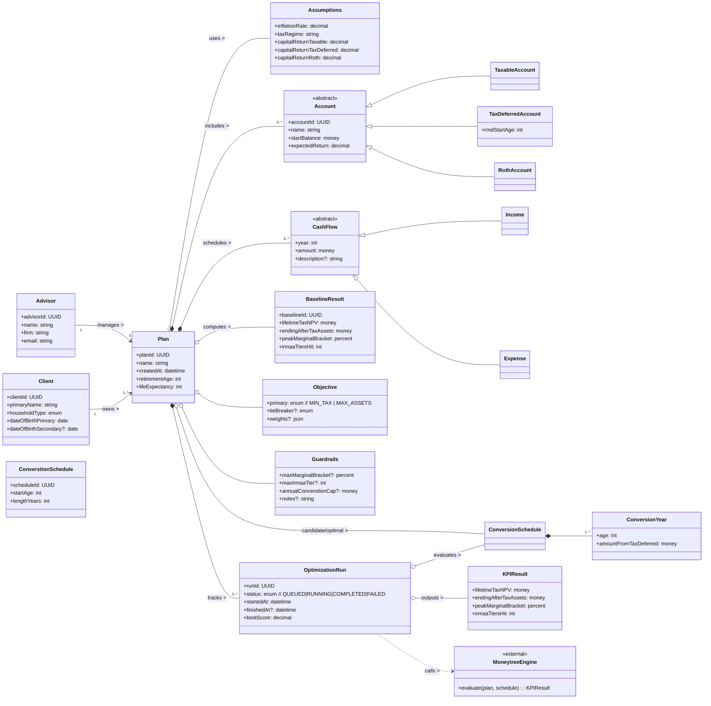

# Domain Model

Jaydon Buckler
9/28/25
Version 1.0 
(Will be subject to change as we continue project)

## UML Class Diagram

## Class Glossary

- **Advisor** - Professional user (financial planner) operating RothScope; used for access control and attribution.
- **Client** - The household being planned for; demographics drive retirement and life expectancy modeling.
- **Plan** - Scenario container linking assumptions, accounts, cash flows, objectives/guardrails, and results.
- **Assumptions** - Economic/tax parameters (inflation, returns per account type, tax regime) independent of decisions.
- **Account / TaxableAccount / TaxDeferredAccount / RothAccount** - Financial buckets with different tax behaviors (RMDs for tax-deferred; tax-free growth in Roth).
- **CashFlow / Income / Expense** - Time-indexed inflows/outflows shaping taxable income and feasibility.
- **BaselineResult** - KPIs for the "as-is" plan (no conversions) used as comparison.
- **Objective** - Optimization goal (minimize taxes or maximize ending after-tax assets).
- **Guardrails** - Advisors constraints (cap bracket, annual conversion cap).
- **ConversionSchedule / ConversionYear** - Year-by-year Roth conversion plan (when/how much).
- **OptimizationRun** - One optimization execution tracking status, best score, and outputs.
- **KPIResult** - Metrics returned by the engine for a schedule (lifetime taxes NPV, ending assets, peak bracket).
- **MoneytreeEngine** - External calculator evaluating a plan + schedule.

